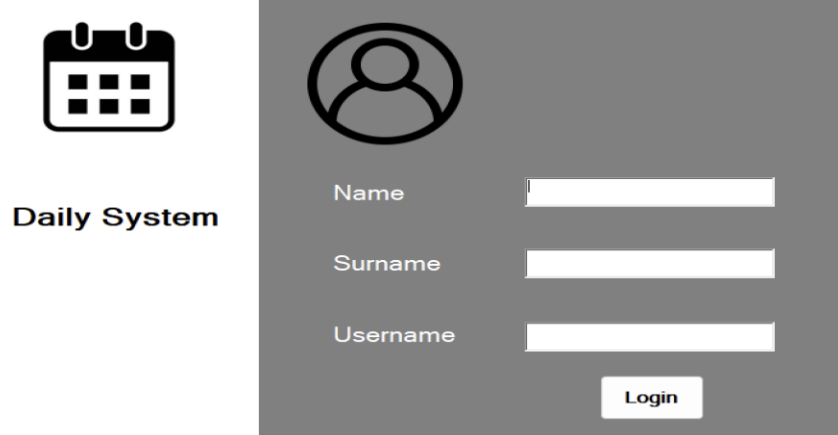

# 🗓️ Digital Diary Application

A Windows-based desktop application developed in C# with WinForms, allowing users to create, update, view, and delete daily journal entries securely. All entries are stored locally in XML format to ensure both readability and structure.

## 📌 Features

- 🔐 **User Login**: Simple login screen to collect name, surname, and username.
- 📝 **Daily Entry Creation**: Users can enter a title, date, and content for each journal entry.
- 📂 **XML Storage**: Each diary entry is saved as a uniquely named XML file using the entry title.
- 📃 **Entry Viewer**: Previously saved entries can be viewed and selected from a list.
- ✏️ **Edit Entries**: Users can update the contents of existing diary entries.
- 🗑️ **Delete Entries**: Unwanted entries can be removed from both the UI and filesystem.

## 💻 Technologies Used

- **C#**
- **WinForms**
- **XML** (for data storage)
- .NET Framework (Windows desktop)

## 📸 Screenshots

### Login Screen


### Main Screen


### XML Output Example
```xml
<Daily>
  <Date>2024-09-15</Date>
  <Title>My Thoughts</Title>
  <Content>Today I worked on the XML logic of this app.</Content>
</Daily>
```

## 🔧 How It Works

1. **Login Page**:
   - Users provide their information which is displayed on load.
2. **Main Page**:
   - Select a date, enter a title and content.
   - Click "Add" to save a new XML file.
   - Click "Update" to overwrite existing content.
   - Click "Delete" to remove the file.
3. **File Management**:
   - All files are listed dynamically and interact with the ListBox.
   - Files are named as `<Title>.xml` and stored in the project directory.

## 🧠 Project Insights

This project was developed during an internship at **E4E Elektronik Mühendislik Yazılım Ltd. Şti.** and aimed to teach best practices in file-based data management, UI design, and structured programming in C#. Through building this application, I gained valuable experience in:
- Real-world software development lifecycle
- Data storage with XML
- Debugging and error handling
- Building user-friendly interfaces

## 🏁 Getting Started

### Installation

```bash
git clone https://github.com/yourusername/digital-diary-app.git
cd digital-diary-app
open with Visual Studio and run
```

---

### 📬 Contact

**Developer**: Gökay Çetinakdoğan  
**Email**: gokay.cetinakdogan@gmail.com  
**Internship Company**: [E4E Engineering](https://www.e4e.com.tr)

